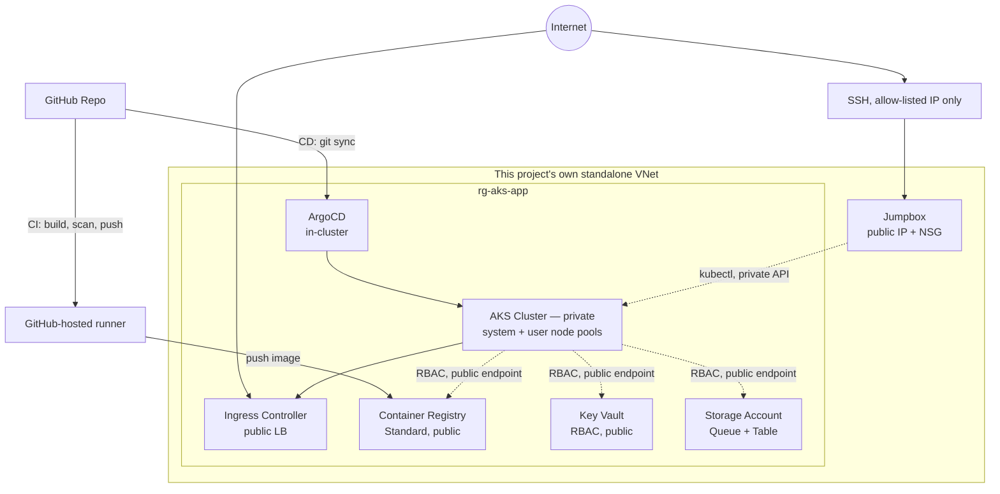
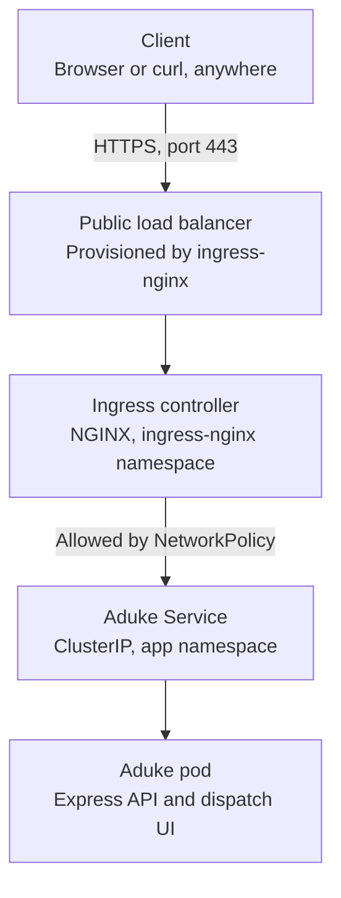
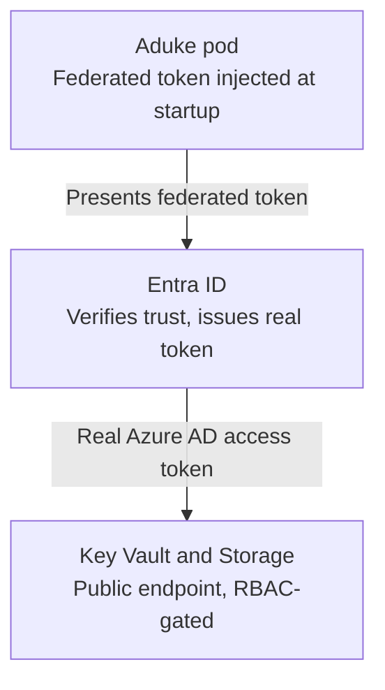
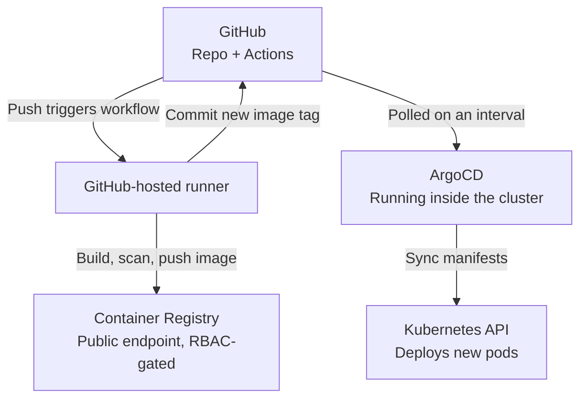

# AKS Container Platform

A standalone Kubernetes platform on Azure — built end to end from
network to application, with GitOps-driven deployment, autoscaling
validated under real load, and deliberate resilience testing.

A private AKS cluster, a two-service application (Aduke + a
queue-driven worker), and the full platform tooling around it: Workload
Identity, ArgoCD-based GitOps, HPA + Cluster Autoscaler, NetworkPolicy
enforcement, and Velero backup. This project was originally built on
top of a separate hub-and-spoke network with Azure Firewall, Bastion,
and private endpoints throughout - later restructured into a genuinely
standalone, lower-cost design. See
[`docs/DECISIONS.md`](docs/DECISIONS.md) for the full reasoning behind
that reversal, including what was deliberately traded away.

---

## Architecture

**The core trade-off, stated honestly:** the AKS API server stays
private (reachable only via the jumpbox) - that decision was kept
deliberately. Everything else that was previously behind a private
endpoint (Key Vault, ACR, Storage) is now public, relying on Azure RBAC
as the actual access control instead of network isolation. Azure
Firewall and Bastion - both real, fixed-hourly-cost resources
regardless of actual traffic - are removed entirely. See
[`docs/DECISIONS.md`](docs/DECISIONS.md) for the full reasoning and
what this genuinely gives up in exchange for the cost reduction.

---

## How the pieces communicate

The zone diagram above shows *where* things live. These three diagrams
show *how they actually talk to each other* — each one a genuinely
separate concern, enforced by a different mechanism.

### 1. The request path

Five hops, but only one is a genuine security decision. The Ingress
controller and Aduke's Service sit in different namespaces
(`ingress-nginx` and `app`) — nothing about Kubernetes itself stops any
other pod in the cluster from reaching Aduke's Service directly. It's
Aduke's own **NetworkPolicy**, allowing traffic only from the
`ingress-nginx` namespace, that turns "technically reachable" into
"actually blocked" for everything else — exactly the boundary
[`docs/networkpolicy-validation.md`](docs/networkpolicy-validation.md)
deliberately tries to break.

### 2. The identity path

This is the mechanism that makes "zero stored credentials anywhere" a
structural fact, not a claim. The middle step is a round trip, and the
entire trust rests on one Terraform resource
(`azurerm_federated_identity_credential`) declaring: *if a token shows
up claiming to be `system:serviceaccount:app:aduke`, signed by this
specific cluster's OIDC issuer, trust it as this specific managed
identity.* No password, connection string, or Kubernetes Secret holds a
credential anywhere in this exchange — the "credential" is a
cryptographically signed claim about which pod is asking, checked
against a trust relationship declared once, in code.

### 3. The delivery path

GitHub is the *only* point these two flows share — there's no direct
line from the runner to ArgoCD, or from the runner to the Kubernetes
API. That's deliberate: CI (the runner) only ever builds, scans, and
pushes; CD (ArgoCD) only ever reads Git and reconciles the cluster to
match it. Neither one ever does the other's job, which is the entire
point of separating them in the first place — see
[`docs/DECISIONS.md`](docs/DECISIONS.md) for the reasoning behind that
boundary.

---

## What's in this repo

| Directory | What it is |
|---|---|
| `aks-platform/` | Terraform — a single, consolidated project: the AKS cluster, its own standalone network, the jumpbox, identities, and every PaaS resource. Previously split across two Terraform roots (`bootstrap/` + `aks-platform/`) to solve a self-hosted-runner chicken-and-egg problem - merged back into one once CI moved to GitHub-hosted runners (see `docs/DECISIONS.md`) |
| `apps/` | Application source — Aduke (API + a small dispatch-board frontend) and the queue-driven worker |
| `charts/` | Helm charts for both services — Deployments, HPA, PDBs, NetworkPolicies, Workload Identity wiring |
| `gitops/` | ArgoCD App-of-Apps structure — the whole cluster's workload state, declared in Git |
| `.github/workflows/` | `terraform.yml` and `build-and-push.yml`, both GitHub-hosted - no self-hosted runner anywhere in this project anymore |
| `k6/` | Load test driving both HPA and Cluster Autoscaler |
| `chaos/` | Resilience test scripts — deliberate pod kill and node drain |
| `scripts/` | `populate-values.sh`/`revert-values.sh` — automate filling real Terraform outputs into Helm `values.yaml`, run automatically by CI |
| `docs/` | `DECISIONS.md` (why things are built this way), `VALIDATION-PLAN.md` (how to prove it all works), `networkpolicy-validation.md` |

---

## Tech stack

**Infrastructure:** Terraform, Azure (AKS, Key Vault, Storage, ACR, Entra ID Workload Identity)
**Cluster:** Azure CNI Overlay, Cilium, self-managed NGINX Ingress
**Application:** Node.js/Express (Aduke), a queue-processing worker, Azure Storage Queue + Table
**Delivery:** Helm, ArgoCD (App-of-Apps), GitHub Actions (GitHub-hosted runners)
**Testing:** k6 (load), custom chaos scripts (resilience), Trivy (image scanning)
**Backup:** Velero

---

## What this demonstrates

This project deliberately spans both **Cloud Engineering** (the Azure
resources themselves — networking, identity, security) and **Platform
Engineering** (what runs on top — Helm, autoscaling, GitOps, developer
experience). Neither half is complete without the other; see
[`docs/DECISIONS.md`](docs/DECISIONS.md) for where that line actually
falls in this build.

- **A deliberate, honest cost/security trade-off** — the AKS control plane stays private (reachable only via a jumpbox); Key Vault, ACR, and Storage are public, relying on Azure RBAC rather than network isolation. See [`docs/DECISIONS.md`](docs/DECISIONS.md) for the reasoning behind this reversal from an earlier, fully-private design
- **Zero stored credentials anywhere** — every identity (the cluster, Aduke, the worker, the CI runner, Velero) authenticates via Workload Identity or managed identity; no connection strings, no static keys
- **Real, validated autoscaling** — HPA and Cluster Autoscaler tuned and load-tested with k6, capturing actual replica-count-over-time data, not just configured and assumed to work
- **Enforced, tested NetworkPolicy** — a deny-by-default pod network with deliberate attempted-and-blocked traffic tests, not just policy YAML sitting unexercised
- **Deliberate resilience testing** — a pod killed mid-job and a node drained under load, both with documented, verified recovery
- **Full GitOps delivery** — ArgoCD manages the entire cluster's workload state from Git, with a clean CI/build vs. CD/sync boundary

---

## Getting started

Full step-by-step deployment procedure — including the exact command to
connect to the jumpbox via its public IP — lives in
[`docs/VALIDATION-PLAN.md`](docs/VALIDATION-PLAN.md), Prerequisites
through Section 2. In short:

0. Create the Microsoft Entra Application, Service Principal, and federated credentials every workflow authenticates through (see the Prerequisites section — a real, non-obvious detail: the `apply` job needs a *different* federated credential than the `plan` job, since declaring an `environment` changes the OIDC subject claim)
1. `terraform apply` in `aks-platform/` — one consolidated project now, no separate bootstrap stage. Creates the standalone network, the jumpbox, the AKS cluster, and every PaaS resource in a single run (needs a real subscription ID, an Entra admin group, an SSH public key, and your own IP for the jumpbox's NSG — see `aks-platform/terraform.tfvars.example`)
2. Fill in the `REPLACE_WITH_TERRAFORM_OUTPUT` placeholders across `charts/*/values.yaml` and `gitops/apps/velero.yaml` — automated by `scripts/populate-values.sh`, run automatically by CI as a reviewable pull request
3. Set repo secrets/variables, push, then bootstrap ArgoCD (`helm install argocd ...`) and apply `gitops/root-app.yaml` — everything else deploys itself from there

---

## Testing & validation

Every phase of this project has a real, runnable validation procedure —
not just a description of what *should* work:

- [`docs/VALIDATION-PLAN.md`](docs/VALIDATION-PLAN.md) — the master procedure, covering infrastructure, GitOps sync, the application smoke test, HPA/Cluster Autoscaler under load, chaos testing, Velero backup, and image scanning, with explicit screenshot markers throughout
- [`docs/networkpolicy-validation.md`](docs/networkpolicy-validation.md) — the detailed deny-and-verify procedure for pod-to-pod traffic restriction

---

## Load test results

*(To be filled in once `k6/load-test.js` has been run against a live
deployment — replica-count-over-time data, p95 latency, and the
scale-up/scale-down timeline captured per
`docs/VALIDATION-PLAN.md` Section 5.)*

---

## Resilience test results

*(To be filled in once `chaos/pod-kill-test.sh` and
`chaos/node-cordon-test.sh` have been run — see
`docs/VALIDATION-PLAN.md` Section 6 for the exact procedure and what
"pass" looks like for each.)*

---

## Decisions & known limitations

Every real architectural decision in this project — including the ones
that were reversed after direct challenge or by later requirements, like
Key Vault's move from public to private and back to public again, and
the whole hub-and-spoke/Firewall/Bastion/private-endpoint layer being
removed entirely for cost reasons — is logged with its reasoning in
[`docs/DECISIONS.md`](docs/DECISIONS.md), along with an honest account
of what's still limited about the current design (single-region, the
genuine security trade-off of public PaaS endpoints, Velero's genuinely
modest practical value given this architecture's stateless, fully
GitOps-managed nature).

---

## Roadmap

| Phase | Status |
|---|---|
| 1. Core cluster (network, identity, ingress) | Complete |
| 2. NetworkPolicy (pod-level zero-trust) | Complete |
| 3. GitOps deployment (ArgoCD) | Complete |
| 4. HPA + Cluster Autoscaler + load test | Complete |
| 5. Chaos/resilience testing + Velero backup | Complete |
